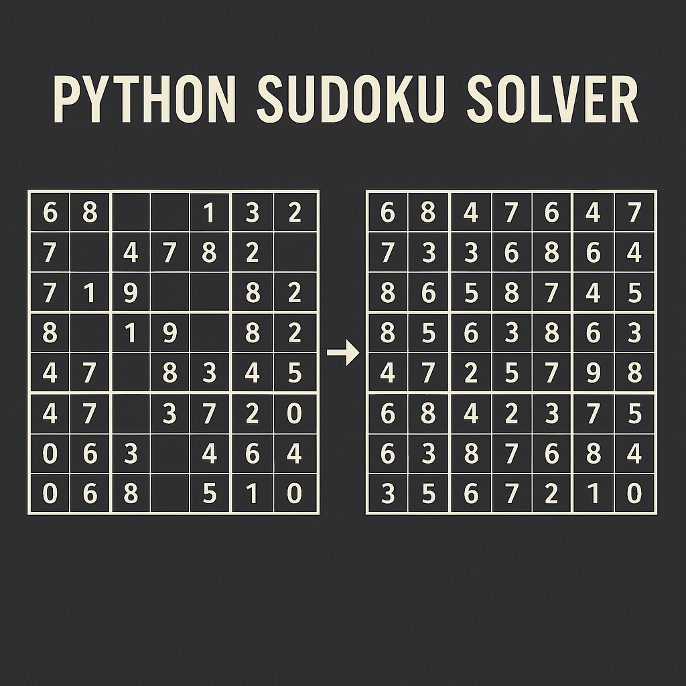

# 🧩 Sudoku Solver en Python



Este proyecto es un **resolutor de Sudokus** implementado en Python, que aplica técnicas de reducción de posibilidades, análisis lógico por filas, columnas y bloques, y una fase final de **backtracking inteligente** cuando es necesario.

## 📌 Descripción

El programa recibe un Sudoku con celdas vacías (representadas con `0`) y lo resuelve paso a paso mediante:

1. **Asignación de posibles valores** para cada celda vacía.
2. **Reducción lógica** de posibilidades mediante análisis:
   - Por fila
   - Por columna
   - Por subcuadrante 3x3
3. **Identificación de valores únicos** dentro de cada bloque.
4. **Backtracking** controlado cuando el razonamiento lógico no es suficiente.

## 🧠 Ejemplo de entrada

```python
sudoku = [
  6, 8, 0, 1, 3, 2, 4, 7, 0,
  7, 0, 4, 0, 9, 8, 0, 0, 2,
  0, 1, 9, 0, 6, 0, 5, 0, 0,
  8, 0, 1, 3, 0, 0, 7, 0, 0,
  0, 0, 0, 8, 0, 0, 3, 4, 5,
  4, 7, 0, 2, 0, 0, 0, 0, 0,
  0, 0, 7, 0, 8, 3, 0, 0, 4,
  0, 0, 0, 0, 0, 5, 6, 0, 0,
  0, 6, 0, 4, 2, 7, 0, 1, 0
]
```

## 🖥️ Uso

```bash
python sudoku_solver.py
```

Se pedirá que introduzcas el sudoku como una lista separada por comas, también puedes editar directamente la variable sudoku en el script si prefieres no usar la entrada manual.

## 📂️ Estructura del Código

1. **print_sudoku**: Muestra el tablero con formato visual.
2. **possibilities**: Lógica principal que resuelve el Sudoku.
3. **check_row, check_column, check_matrix**: Eliminan candidatos no válidos.
4. **check_matrixUnique**: Encuentra valores únicos dentro de un bloque.
5. **tryPossibilities**: Algoritmo de backtracking para resolver casos complejos.
6. **iterations**: Ejecuta el proceso de deducción hasta que no haya más cambios.

## ✅ Requisitos

Python 3.x

## 📄 Licencia

Este proyecto está bajo la Licencia MIT. Puedes usarlo, modificarlo y distribuirlo libremente.

## 🧑‍💻 Autor
Desarrollado por [Alejandro Molinos Eligio](https://github.com/AlejandroMolinosEligio)
